>**BTT SKR Mini E3 V3 Setup gude **

Sourced from [here](https://www.makenprint.uk/3d-printing/3d-printing-guides/3d-printer-mainboard-installation-guides/btt-skr-mini-e3-v3-guides/btt-skr-mini-e3-v3-setup-guide/) Translated into MD format for easy refrenrece 
# index 

* index

# Notes about wiring 
Although our intention is to keep the BTT SKR Mini E3 V3 Setup Guide as simple and easy to follow as possible. However there may be an odd cable or connector that needs to be rewired. But worry not. As more often than not, it is a simple case of pushing the metal retaining pins down with a tool or pin. Followed by pulling out the cable. Then with the cable removed, lift the pushed down pin backup with a fingernail. Simply reposition the cables as needed and push back in.
Whether you need to rewire or not is dependent on each printer and its components.

# Power Supply Jumpers (power source options)
By default the BTT SKR Mini E3 V3 is set to be powered via the Power Supply Unit. But if you wish to power the board via USB for means of testing. Then place a jumper over the SW_USB header pins (Between the RESET button and USB port). BUT don’t forget to remove it after.
A point of note, powering the SKR Mini E3 V3 via USB is not a replacement method of powering the board. Instead, it is a means to test the board and firmware settings before installing the mainboard.

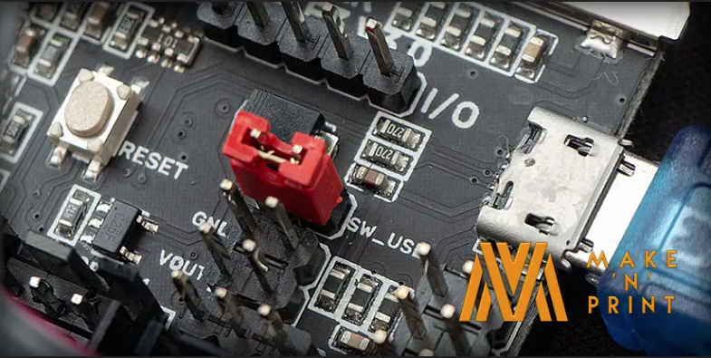

# Power Connections
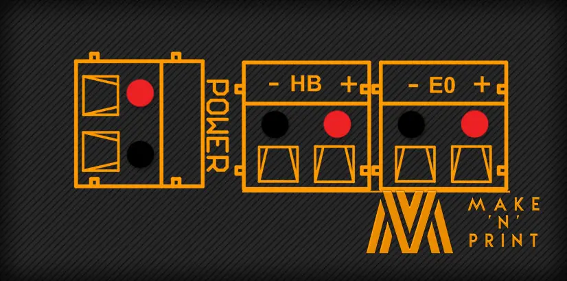

When upgrading any mainboard on a 3D printer, the wiring sequence of the cables may differ from the original mainboard. Consequentially, the polarity of the wiring must always be checked and double-checked.
But what do I mean by polarity? Moreover, the + (red) cable goes to the positive connections (+) and the – (black) wire goes to the negative or ground connection (-).
If handling the electrics worries you. Then fear not, follow along step by step, and you will be fine.

> DC IN 

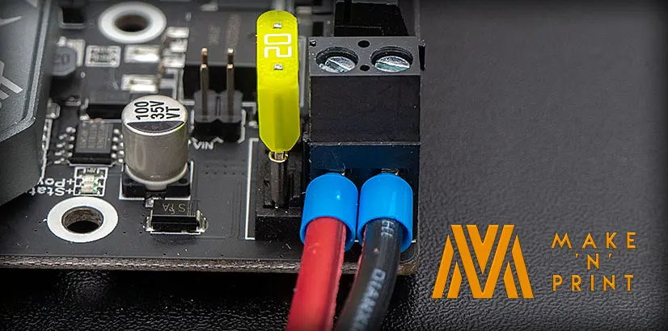

Firstly the BTT SKR Mini E3 V3 needs power from the Power Supply Unit (PSU) to function. Firstly take a red Positive (V+) cable from the PSU and insert it into the left-hand side of the DCIN connector. Then take a black Negative (V-) wire from the PSU and insert it into the right-hand side of the DCIN connector.

# Heated Bed
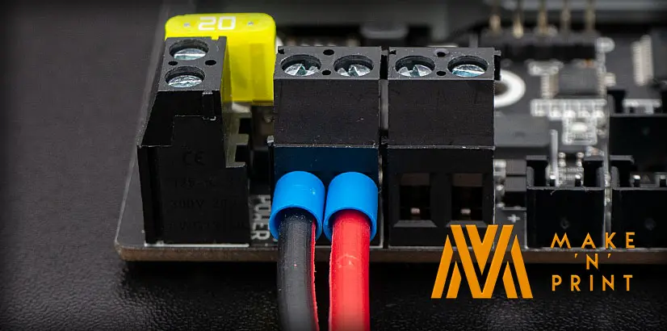

Importantly the wire orientation/polarity for the heated bed is different from the DCIN connection. Moreover, the Red Positive (+) cable inserts on the right-hand side of the HB connector, while the Black Negative (-) cable inserts into the left-hand side.
Some will argue polarity doesn’t matter on heated beds. Yet on many beds, it is critical. Especially those heated beds with LED’s attached on the underside, as these indicate the power is being received and flicker when controlled by PID tuning. Consequentially most heated beds have positive and negative traces and contacts marked on them.

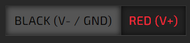

# Heating Element (Hotend)

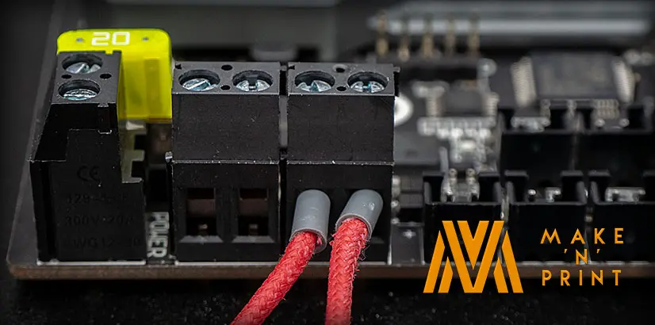

For the most part, heating elements on 3D printers are not polarity sensitive and are insertable either way around. But if the cables have markings on them, check the manufactures documentation for references to polarity.

# Thermistor 
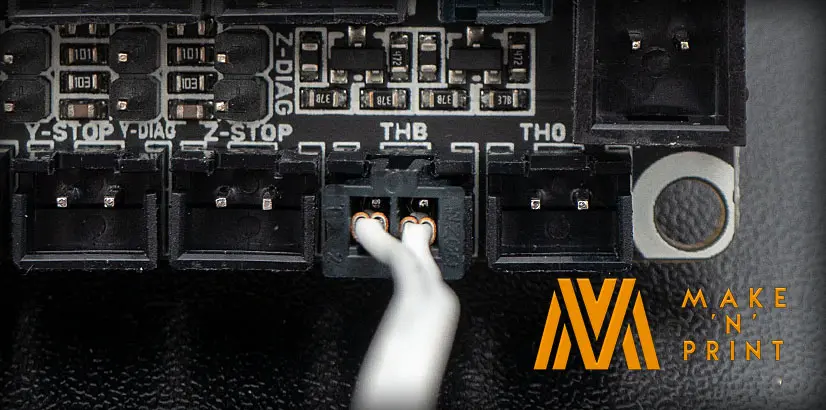

Likewise, thermistors are not polarity sensitive. But for the printer to function correctly, they need inserting into their corresponding connections. Moreover, the heated bed thermistor plugs into the THB connector and the hotend thermistor into TH0.
If you purchased replacement thermistors with a long black Dupont style connector. These will work fine on the SKR Mini E3 V3 mainboard. Nonetheless, I recommend changing the connector to a two-pin JST-XH, as they will hold better to the mainboard. Alternatively, you could use a hot glue gun to keep the connector in place.

# Onboard TMC2209 StepperDrivers

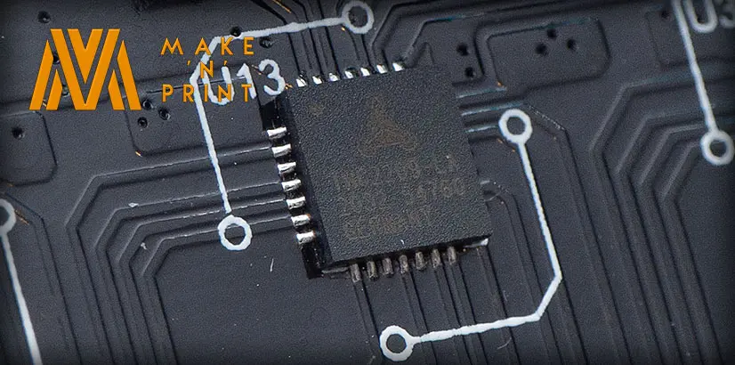

Because the mainboard features onboard TMC2209 stepper drivers, the BTT SKR Mini E3 V3 is pre-configured to utilise **UART** mode. Thus no jumpers need enabling for this feature.

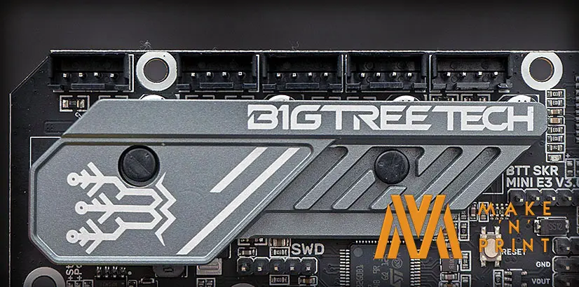

The BTT SKR Mini E3 V3 has the stylised heatsink pre-installed, it saves time. As we no longer need to attach heatsinks onto the stepper drivers.
Although heatsinks are great at helping components keep cool, active cooling is still required. Such as the fan inside the Creality Ender 3 mainboard enclosure. This fan helps to blow the radiated heat away from the heatsink.

# Sensorless Homing 

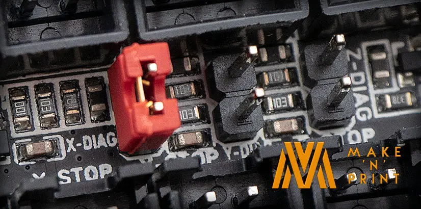

Whether you are a fan of sensorless homing or not, enabling and disabling the feature on the SKR Mini E3 V3 mainboard is a quick process. Specifically, a jumper needs to be placed on the stepper drivers DIAG pins on the mainboard. As a result, the jumper bridges the connection allowing the signal to flow through the mainboard.
Although inserting a jumper over the X-DIAG and Y-DIAG pins enables the hardware side of the sensorless homing. But further configuration will be required within the 3D printer’s firmware.
If you wish to use the physical limit switch endstops, such as those found on the Creality Ender 3, then the DIAG pins MUST be left with no jumpers connected

# Stepper Motor Wiring

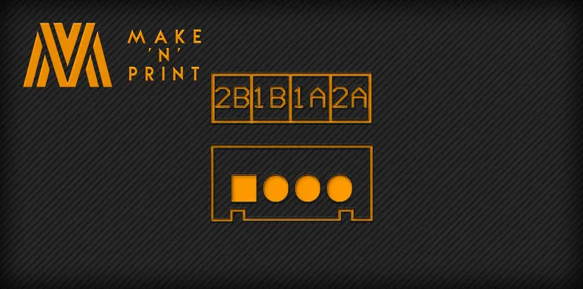

Because the BTT SKR Mini E3 V3 serves as a drop-in replacement for Creality Ender 3 mainboards, the stepper motor wiring should be simply a case of inserting the correct cable into the corresponding connector. For example, the X-Axis stepper motor cable will plug into the XM connector on the SKR Mini E3 V3 mainboard.
However, for those not using the SKR Mini E3 V3 in a Creality Ender 3, a little rewiring may need doing.
But first, let’s explain a little more about how they work. Moreover, Nema 17 stepper motors operate with two coils with wiring in pairs. Namely, the first pair 1A and 1B move the stepper motor in one direction, while 2A and 2B move in the opposing direction.

Sadly with so many stepper motors on the market and no set standard on their wiring, writing a guide becomes near impossible. Instead, use the diagram above to match the pairs (1A & 1B, 2A & 2B) of the stepper motors to the mainboard. If you require further assistance, I suggest reading our Stepper motor wiring guide, which details three easy ways of finding the paired/phased connections of a stepper motor.

# EndStops
Similarly to the stepper motor wiring, the limit switches for each axis need inserting into the correct positions. Such as the X-Axis endstop cable inserts into the X-STOP connector on the BTT SKR Mini E3 V3 mainboard.
But for those not using the Creality Wiring, the above example shows the wiring orientation for the endstops. Specifically, the Black Ground wire sits on the left-hand side of the connector.

# Fans 

Without a doubt, having three PWM controllable fan outputs on the SKR Mini E3 V3 is perfect for using thermostatically controlled fans to save on both noise and power.
Particularly important is that the Voltage of fans must be the same as the power supply connected to the mainboard. For instance, if using a 12 Volt power supply, you will need 12V fans. Similarly, if using a 24 Volt power supply, you will need 24V fans.

## Part Cooling Fan

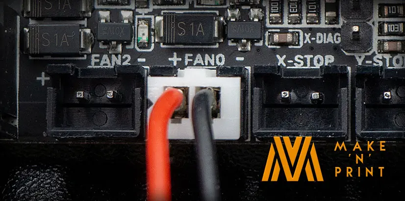

By default, the connection for the cooling fan for the filament is FAN0, with the red positive (+) wire to the left and the black negative (-/GND) to the right.

## Board Controller Cooling Fan
Additionally, the **FAN1** connection is located idyllically for use with the fan that helps keep the mainboard cool. Like the part cooling fan, the polarity is with the red positive (+) wire to the left and the black negative (-/GND) to the right.

## Hot End Heatsink Fan

Finally, the fan connection for the hotend heatsink fan is the **FAN2** connection. Once again, the red positive (+) wire to the left and the black negative (-/GND) to the right

# Bltouch Wiring

Because there are many clones of the BLTouch, their wiring could be different to a genuine Antclabs BLTouch probe. However, there tend to be two main patterns to the wiring schemes. Firstly there is the authentic Antclabs colour scheme, followed by an alternative colour coding of the wiring used by most clones. Because of this, I have listed these two main variants below.

## Antclabs BLTouch wiring

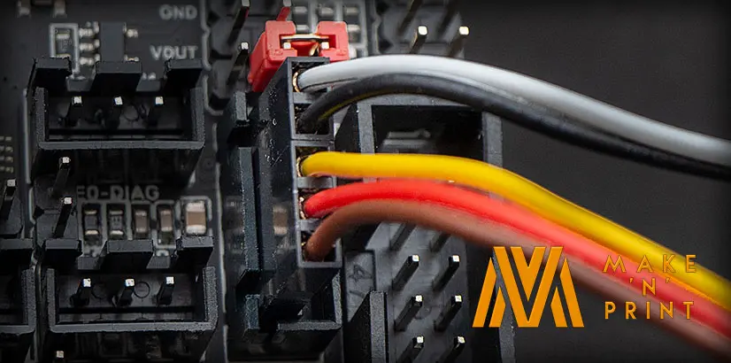

With a pinout of : 

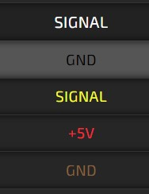

## Alternative BlTouch Colour Code Wiring

Furthermore, I have listed both the original and alternative wiring colour codings from top to bottom. Importantly the bottom wire is GND (Brown or Blue) and is closest to the thermistor connections, and the White probe SIGNAL is nearest the USB port.

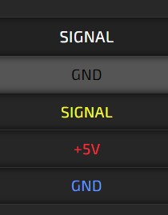